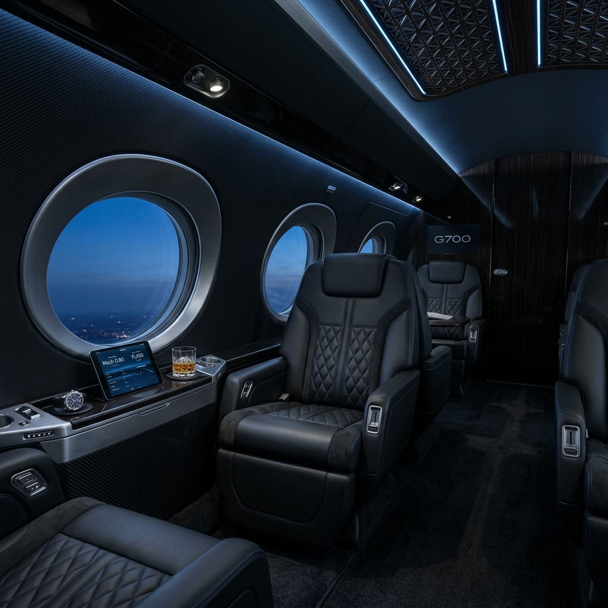

# AeroLux: Ultra-Premium Airline Experience



## Overview
AeroLux is a conceptual front-end web application for a luxury American airline. Designed with an ultra-premium aesthetic inspired by high-end automotive brands (like Bugatti), the project showcases deep blacks, sleek typography, micro-animations, and striking visual elements. 

This project was built to demonstrate modern web design principles and high-fidelity UI implementation.

## Features
- **Immersive Dark Mode UI:** Deep blacks and sharp contrasts to evoke a sense of high-end luxury.
- **Glassmorphism:** Modern, sleek booking widget with frosted glass effects.
- **Micro-Animations:** Smooth fade-ins and interactive elements to bring the interface to life.
- **Responsive Layout:** Built with modern CSS techniques for a seamless experience.

## Tech Stack
- **Framework:** React
- **Build Tool:** Vite
- **Styling:** Vanilla CSS (Custom Properties, Flexbox/Grid)
- **Typography:** Google Fonts (Inter)

## Getting Started

To run this project locally:

1. Clone the repository:
   ```bash
   git clone https://github.com/Keshava-prog/aerolux-airline.git
   ```
2. Navigate to the project directory:
   ```bash
   cd aerolux-airline
   ```
3. Install dependencies:
   ```bash
   npm install
   ```
4. Start the development server:
   ```bash
   npm run dev
   ```

## Author
[Keshava-prog](https://github.com/Keshava-prog)
